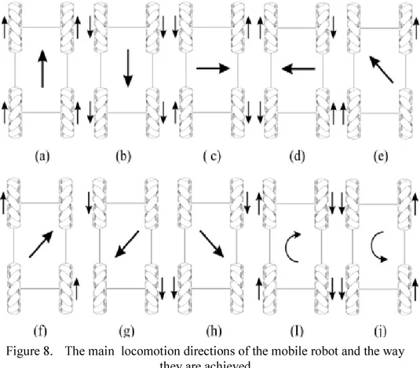

# 🤖 Differential Wheeled Robot Models

## 🚀 Differential Wheeled Robot Inverse Kinematics

This model calculates the angular velocities required for each wheel to achieve specified linear and angular velocities.

- **Input Parameters**:
  - Wheel Radius (`r`)
  - Distance Between Wheels (`b`)
  - Desired Linear Velocities (`Vx`, `Vy`)
  - Desired Angular Velocity (`W`)
  - Initial Orientation (`theta_initial`)

- **Outputs**:
  - **Wheel Velocities**: Angular speeds of the right and left wheels.
  - **Global Frame Velocities**: Linear velocities (`Vx`, `Vy`) and angular velocity (`W`).

## 🛠️ Differential Wheeled Robot Kinematics

This model computes the robot’s linear and angular velocities from the angular velocities of its wheels.

- **Input Parameters**:
  - Angular Velocities of Wheels (`wr`, `wl`)
  - Robot Orientation (`theta`)

- **Outputs**:
  - **Local Frame Velocities**: Linear velocities (`vx`, `vy`) and angular velocity (`w`).
  - **Global Frame Velocities**: Adjusted linear velocities (`Vgx`, `Vgy`) and angular velocity (`wg`).

## 🤖 Inverse Kinematics Model for Shato Bot

This model calculates wheel angular velocities for a Shato bot with a specific orientation, based on the research [here](https://research.ijcaonline.org/volume113/number3/pxc3901586.pdf).

- **Input Parameters**:
  - Wheel Radius (`r`)
  - Half Length (`lx`) and Width (`ly`) of the Robot
  - Desired Linear Velocities (`Vx`, `Vy`)
  - Desired Angular Velocity (`w`)
  - Initial Orientation (`theta_initial`)

- **Outputs**:
  - **Wheel Velocities**: Angular velocities for each wheel (Upleft, Upright, Downright, Downleft).
  - **Global Frame Velocities**: Linear velocities (`vgx`, `vgy`) and angular velocity (`wg`).

## 🔧 Kinematics Model for Shato Bot

This model calculates the linear and angular velocities for a Shato bot equipped with omni wheels, based on the same research [here](https://research.ijcaonline.org/volume113/number3/pxc3901586.pdf).

- **Input Parameters**:
  - Wheel Radius (`r`)
  - Half Length (`lx`) and Width (`ly`) of the Robot
  - Angular Velocities of Omni Wheels (`w1`, `w2`, `w3`, `w4`)
  - Orientation (`theta`)

- **Outputs**:
  - **Local Frame Velocities**: Linear velocities (`vx`, `vy`) and angular velocity (`w`).
  - **Global Frame Velocities**: Adjusted linear velocities (`vgx`, `vgy`) and angular velocity (`wg`).
